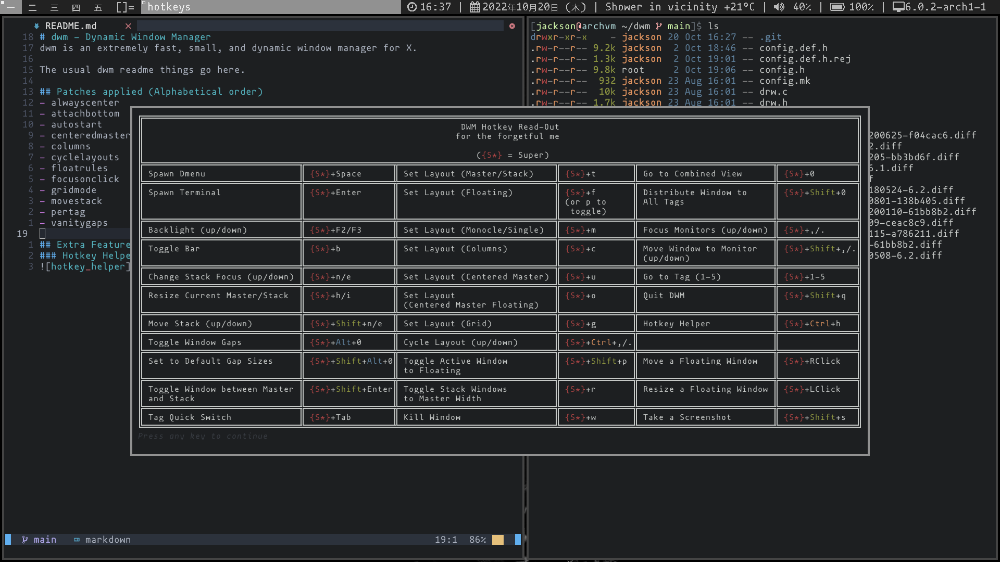

# dwm - Dynamic Window Manager
dwm is an extremely fast, small, and dynamic window manager for X.

The usual dwm readme things go here.

## Patches applied (Alphabetical order)
- alwayscenter
- attachbottom
- autostart
- centeredmaster
- columns
- cyclelayouts
- floatrules
- focusonclick
- gridmode
- movestack
- pertag
- vanitygaps

## Extra Features Added (when using my .dotfiles)
### Hotkey Helper (Super + Ctrl + H)

